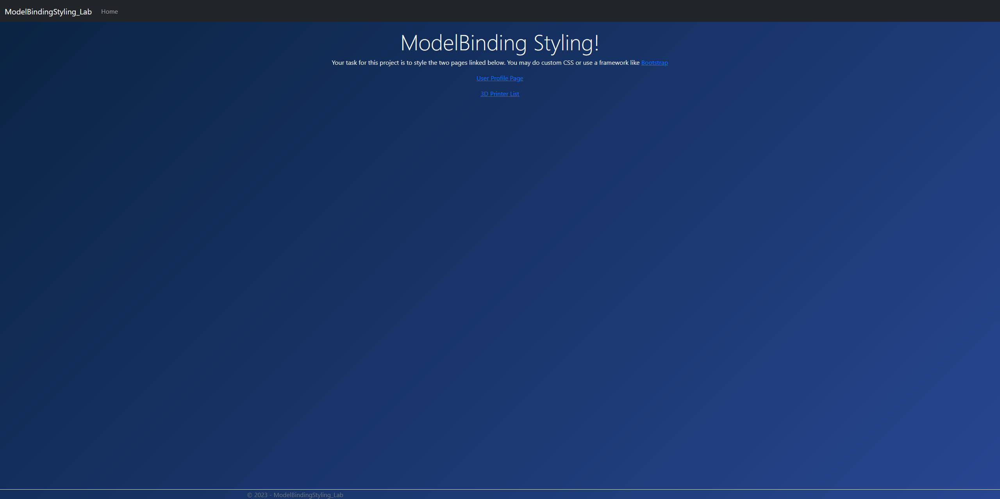
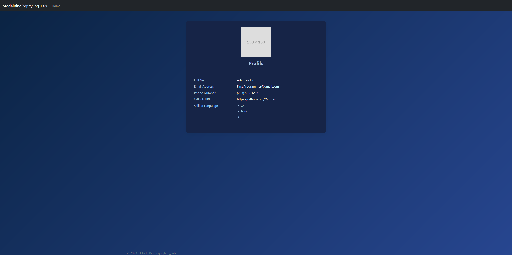
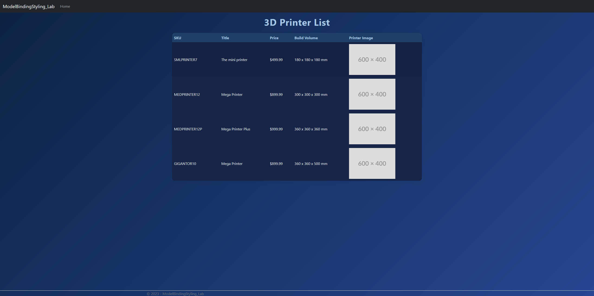

# CPW219-ModelBinding Styling Lab

`Starter code for lab activity. Your task is to change the UserProfile page and 3D printer list pages and style them. You can
use custom CSS or a framework like Bootstrap`

I chose to style my web pages with a modern theme and a deep blue color scheme. I started by styling the 3d printer page witht the help of Copilot. I polished the results and then used Agent mode to replicate the style of the 3d printer page onto the User page. After more polishing and changing the div layout that got generated, I was left with 2 pages that had cohesive styling. Finally, I styled the main page and the navbar. This was easy enough to do without Copilot.

## Images

